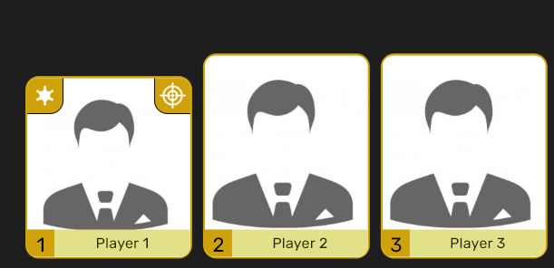

# Mafia HUD

Приложение для отображения состояния игроков в игре "Мафия" на `Flutter`.

1. Прозрачное окно для вывода состояния игроков и игровой информации (в будущем)
2. Окно управления состоянием игроков.

## Запуск
TODO: Надеюсь добавить сборки
## Сборка из исходников

```bash
flutter pub get
flutter run --release
```

## Интерфейс
В данный момент реализован минимальный набор функций управления.


### Управление
Управление происходит в окне инструментов.
* Двойное нажатие по иконке позволит загрузить изображение.
* Стрелки вверх и вниз при наличии загруженных изображений позволит перемещать игроков.
* `+` и `-` отвечают за размер шрифта никнейма игрока на окне с HUD.
* В остальном интуитивно

## Текущее состояние

- Управление ролями, никнеймами
- Анимация карточек при уходе из-за стола игроков
- TODO: Добавить информацию по отстрелам, проверкам и выставлениям.
- TODO: Добавить изменение цвета плашек для ролей
